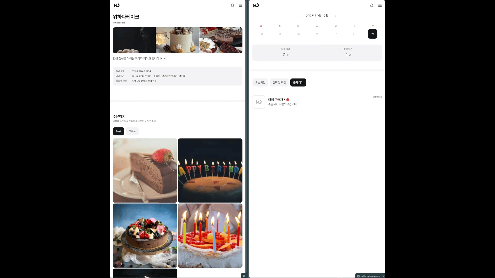
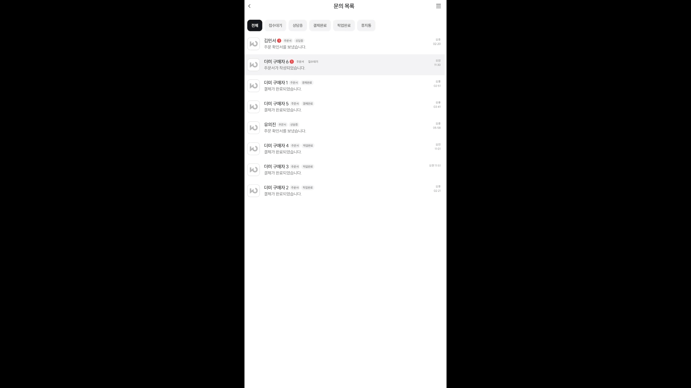
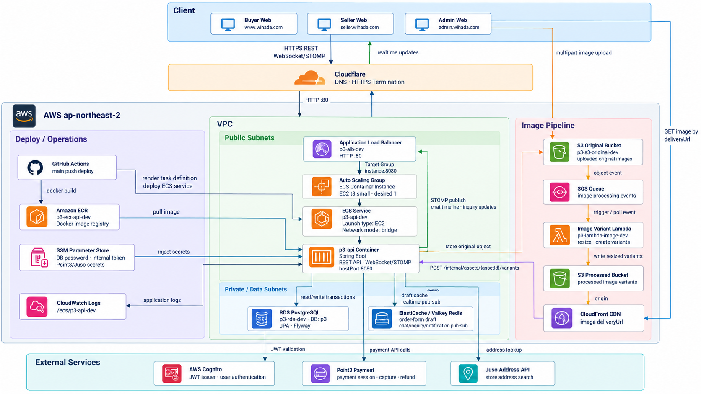
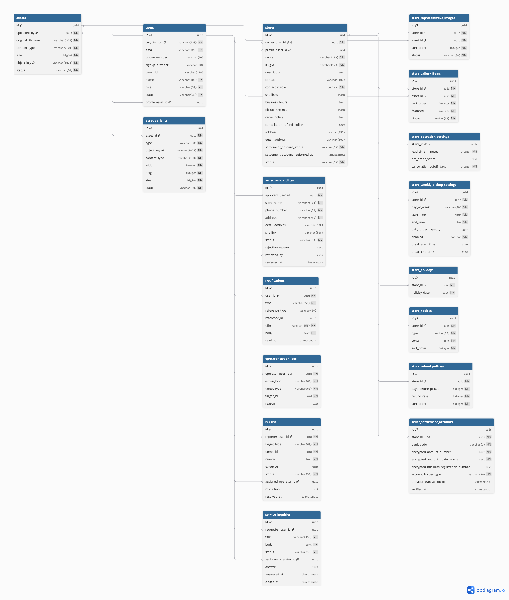
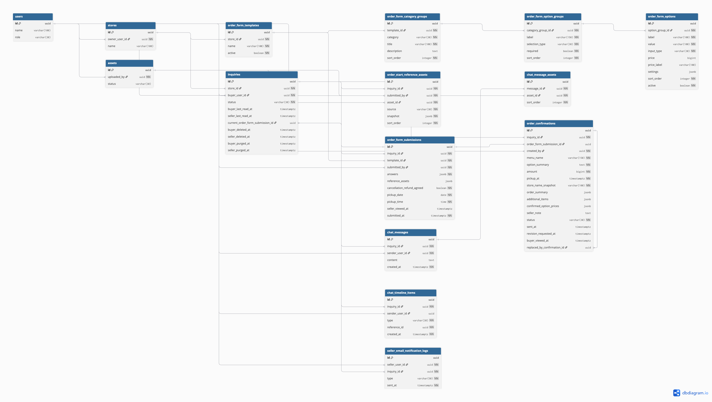
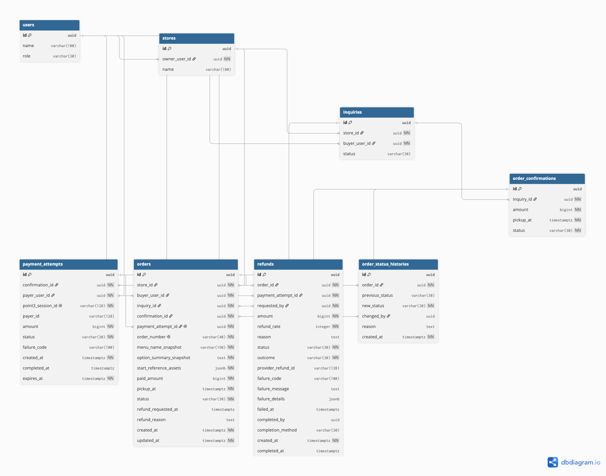

## wihada project
[](https://openjdk.org/)
[](https://spring.io/projects/spring-boot)
[](https://www.postgresql.org/)
[](https://redis.io/)
[](https://stomp.github.io/)
[](https://aws.amazon.com/)
[](https://github.com/features/actions)

> 본 저장소는 바이올렛페이 인턴 기간에 진행한 팀 프로젝트에서 제가 담당한 백엔드 구현을 포트폴리오 목적으로 별도 보관한 저장소입니다.  
> 원본 프로젝트는 팀 단위로 진행되었으며, 본 저장소는 제가 참여했던 시점의 코드를 기준으로 정리했습니다.

### 프로젝트 소개

wihada는 인스타그램 등 SNS를 통해 주문을 받는 소셜 셀러를 위한 주문·상담·결제 관리 플랫폼입니다.

기존에 DM과 수기 주문서로 분산되어 있던 주문 과정을 하나의 상담방에서 관리할 수 있도록 구성했습니다. 구매자는 주문서를 제출하고 판매자와 상담한 뒤 주문확인서를 통해 주문을 확정할 수 있습니다. 판매자는 주문 접수부터 결제, 픽업, 환불까지의 과정을 관리할 수 있습니다.

---

### 담당 기능

- Cognito 기반 인증과 구매자·판매자 역할별 접근 제어
- 스토어, 주문서, 상담 및 주문확인서 도메인 설계·구현
- 주문·결제·픽업·환불 상태 흐름과 Point3 결제 연동
- STOMP·Redis 기반 채팅 타임라인 및 실시간 상담 상태 갱신
- S3·SQS·Lambda 기반 비동기 이미지 처리 파이프라인
- 판매자 주문·매출 조회와 이메일 알림 기능
- GitHub Actions·ECR·ECS 기반 CI/CD 및 AWS 배포 환경 구성

---

### 주요 기능

#### 주문 및 상담 흐름

구매자의 주문서 제출부터 판매자의 주문확인서 발행, 결제, 픽업 완료까지 하나의 상담 흐름으로 관리합니다.



#### 판매자 주문 관리

판매자는 접수된 상담과 주문을 확인하고 주문확인서 발행, 결제 상태 확인, 픽업 완료 등의 업무를 처리할 수 있습니다.



---

### 시스템 아키텍처

Cloudflare를 외부 DNS·HTTPS 프록시로 사용하고, AWS VPC 내부의 ALB와 ECS 서비스로 요청을 전달합니다.  
애플리케이션 데이터는 PostgreSQL에 저장하며, Redis Pub/Sub을 통해 다중 인스턴스 환경의 실시간 이벤트를 전달합니다.  
이미지는 S3 업로드 이후 SQS와 Lambda를 통해 비동기로 리사이징하고 CloudFront로 제공합니다.



---

### 핵심 기술 구현

#### 1. 실시간 상담 타임라인

~~~text
DB 저장 → Transaction Commit → Redis Pub/Sub
       → 각 ECS 인스턴스 → STOMP Topic → Client
~~~

WebSocket/STOMP를 사용해 채팅방별 실시간 연결을 제공하고, Redis Pub/Sub으로 여러 애플리케이션 인스턴스에 이벤트를 전달했습니다.

일반 메시지뿐 아니라 주문서 제출, 주문확인서 발행, 결제 완료, 환불 요청을 공통 타임라인 이벤트로 관리했습니다. DB 반영 전에 클라이언트가 이벤트를 수신하는 경쟁 상태를 방지하기 위해 **트랜잭션 커밋 이후 실시간 이벤트를 발행**하도록 구성했습니다.

**관련 구현**

- [`ChatTimelineItemPublisher`](src/main/java/io/point3/p3api/chat/application/timeline/ChatTimelineItemPublisher.java)
- [`RedisChatTimelinePublisher`](src/main/java/io/point3/p3api/chat/infrastructure/redis/RedisChatTimelinePublisher.java)

---

#### 2. 주문 스냅샷과 상태 관리

주문서 양식이나 참조 이미지가 수정되더라도 과거 주문 내역이 바뀌지 않도록 **주문 제출 시점의 옵션과 이미지를 스냅샷으로 저장**했습니다.

상담방 상태와 개별 주문서의 확인 상태를 분리하고, 문의방이 현재 처리 중인 주문서를 명시적으로 관리했습니다. 이를 통해 과거 주문에서 늦게 발생한 결제·픽업 이벤트가 새로운 상담 상태를 변경하지 않도록 했습니다.

**관련 구현**

- [`OrderFormSubmission`](src/main/java/io/point3/p3api/inquiry/domain/entity/OrderFormSubmission.java)
- [`OrderConfirmationService`](src/main/java/io/point3/p3api/order/application/OrderConfirmationService.java)
- [`OrderReferenceAssetDeliveryService`](src/main/java/io/point3/p3api/order/application/query/order/OrderReferenceAssetDeliveryService.java)

---

#### 3. 비동기 이미지 처리

~~~text
원본 이미지 업로드
    → S3 Original
    → SQS
    → Lambda 리사이징
    → S3 Processed
    → CloudFront
~~~

원본 이미지 업로드와 리사이징 작업을 분리해 API 서버가 이미지 처리 시간의 영향을 받지 않도록 구성했습니다. Lambda는 썸네일·중간·상세 이미지를 생성하며, 처리 결과는 CloudFront를 통해 제공합니다.

클라이언트가 S3 버킷이나 객체 키 구조를 직접 조합하지 않도록 백엔드에서 에셋 상태와 `deliveryUrl`을 함께 제공합니다.

---

#### 4. 결제 멱등성과 상태 일관성

결제 요청마다 내부 `PaymentAttempt`를 생성하고 주문확인서와 연결해 외부 결제 상태를 추적했습니다.

동일한 주문확인서에 진행 중인 결제가 있으면 기존 결제 시도를 재사용하여 **새로고침과 재시도로 인한 중복 결제 요청을 방지**했습니다.

결제 승인 결과를 주문 상태 및 타임라인 이벤트와 함께 처리하고, 동일 요청이 반복되어도 주문이 중복 생성되지 않도록 멱등성을 보장했습니다.

---

### ERD

도메인 간 관계를 명확하게 확인할 수 있도록 주요 영역별로 ERD를 분리했습니다.

#### 사용자 · 스토어 · 에셋



#### 문의 · 채팅 · 주문서 제출



#### 결제 · 주문 · 환불



---

### AI 활용을 고려한 개발 방식

본 프로젝트는 AI 코딩 에이전트를 적극적으로 활용해 개발했습니다. AI 사용을 단순한 코드 생성에 한정하지 않고, 작업 범위를 명확하게 제한하고 결과를 반복 검증할 수 있도록 아키텍처와 테스트 전략을 함께 설계했습니다.

#### AI 작업 단위를 고려한 아키텍처

프로젝트의 특성과 구현 비용을 고려해 엔티티와 도메인 모델은 하나로 통합했습니다. 대신 영속성, 결제, 메시징, 객체 저장소와 같은 외부 의존성에는 헥사고날 아키텍처의 포트·어댑터 구조를 적용했습니다.

레이어드 아키텍처보다 의존 방향과 인터페이스 계약을 명시적으로 드러낼 수 있어, AI 작업 범위를 하나의 유스케이스나 어댑터 단위로 제한하기 용이하다고 판단했습니다. 이를 통해 기능 수정 시 핵심 도메인 규칙과 외부 구현이 함께 변경되는 범위를 줄이고, 작은 작업 단위로 구현과 검증을 반복할 수 있도록 했습니다.

#### 반복 가능한 통합 테스트

AI가 생성한 코드에서 신뢰할 수 있는 결과물을 확보하려면 구현 이후 동일한 조건으로 반복 실행할 수 있는 검증 수단이 필요하다고 판단했습니다.

과도한 mocking은 실제 JPA 매핑, SQL, 데이터베이스 제약조건과 트랜잭션 문제를 가릴 수 있기 때문에 지양했습니다. 주요 기능은 Spring 통합 테스트와 Testcontainers 기반 PostgreSQL 환경에서 검증하여 실제 저장·조회, 상태 전이와 트랜잭션 동작을 함께 확인했습니다.

#### Postman CLI 기반 시나리오 테스트

개별 유스케이스와 API가 정상 동작하더라도 전체 사용자 흐름에서는 데이터와 상태가 올바르게 연결되지 않을 수 있습니다. 이를 검증하기 위해 주요 사용자 여정을 Postman 컬렉션으로 구성하고 CLI에서 반복 실행할 수 있도록 했습니다.

주문서 제출, 판매자 확인, 주문확인서 발행, 결제, 픽업과 환불로 이어지는 시나리오를 순차 실행하며 다음 항목을 검증했습니다.

- 이전 요청의 응답이 다음 요청에 올바르게 전달되는지
- API 간 상태 전이가 일관되게 반영되는지
- 인증과 권한 검증이 사용자 역할에 맞게 동작하는지
- 실패 이후 재시도에서도 데이터 정합성이 유지되는지

#### 단계적인 검증 절차

AI 작업 결과는 컴파일 성공만으로 완료하지 않고 다음 단계로 검증했습니다.

```text
관련 통합 테스트
→ 전체 테스트
→ 정적 분석 및 포맷 검사
→ Postman CLI 시나리오
→ 개발 서버 배포
→ 실제 API 응답과 운영 로그 확인